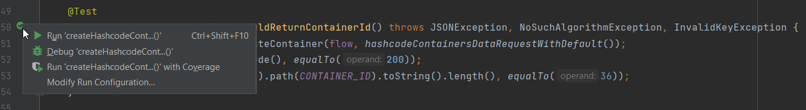

# Integration Tests for SiGa (Signature Gateway)

## Prerequisites

* Java 21 JDK
* [Signature Gateway](https://github.com/open-eid/SiGa) running in local or remote environment

## Configuring the tests

Modify the file [application.properties](src/test/resources/application.properties) according to the
environment where SiGa is running at.
Running in remote environment, it´s necessary to configure valid Client authorization data in
[TestData.java](src/test/java/ee/openeid/siga/test/helper/TestData.java).
More about authorization - [Authorization](https://github.com/open-eid/SiGa/wiki/Authorization).

If you are running SiGa in local docker-compose setup as described at
https://github.com/open-eid/SiGa#running-siga-with-docker, then the default configuration should work.

**Descriptions of parameters in `application.properties`:**

| Parameter                     | Example                              | Description                                                  |
|:------------------------------|:-------------------------------------|:-------------------------------------------------------------|
| siga.application-context-path | `/siga-webapp-2.0.1`                 | Custom service context.                                      |
| siga.hostname                 | `localhost`                          | Service URL.                                                 |
| siga.port                     | `8443`                               | Service port.                                                |
| siga.protocol                 | `https`                              | Service protocol.                                            |
| siga.profiles.active          | `datafileContainer,smartId,mobileId` | Define what profile tests to run.                            |
| test-files-directory          | `src/test/resources/`                | Test files directory path.                                   |
| rest-assured-console-logging  | `false`                              | Enable RestAssured request/response console logging filters. |

## Running tests

**NB!** [MonitoringT](src/test/java/ee/openeid/siga/test/MonitoringT.java) tests do not pass locally as SIVA status is
always DOWN.

### Using Maven

Run tests

```bash
./mvnw clean verify
```

**PS!** Groovy and Scala tests do not run automatically.

### Using IntelliJ

1. At first, generate dynamic classes from WADL and XSD.

```bash
./mvnw clean compile
```

2. Open this project in IntelliJ (community version will do)
3. Open File -> Project Structure
4. In the view:
    * Make sure Project -> SDK points to Java 21
5. Open `*T.java` or `*Spec.groovy` file and JUnit Run option should be displayed.
   

### Report:

For a report, Allure is
required ([instructions for download](https://allurereport.org/docs/gettingstarted-installation/)).

After running the tests, you can serve locally Allure report:

`allure serve ./target/allure-results/`
